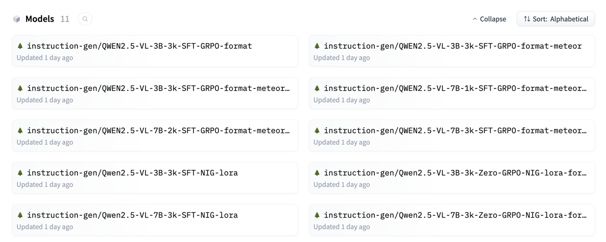

# 🔥 Navigation Instruction Generation
## 1. Installation
~~~
conda create -n r1-v python=3.11 
conda activate r1-v
bash setup.sh
~~~

## 2. Settings
### 2.1 Dataset Configuration
Please download the train and test datasets from Huggingface.

* Train dataset: [Download](https://huggingface.co/datasets/instruction-gen/nig4vi-train)
* Test dataset: [Download](https://huggingface.co/datasets/instruction-gen/nig4vi-test)
* Images: [Download](https://mega.nz/file/nJpiDBTI#fOJumJVbe-r3UqUVrcnOS4offoREUyliQE9rfAXgUVU)

You'll need to configure the dataset path in:
~~~
src/open-r1-multimodal/data_config/
~~~

### 2.2 Rewards
The reward functions are implemented in:
~~~
./VLM-R1-format-meteor-LLM/src/open-r1-multimodal/src/open_r1/vlm_modules/qwen_module.py
~~~

## 3. Running
It's recommended to use tmux for training sessions:
~~~
conda activate r1-v

tmux new -s 3B_3k

bash src/open-r1-multimodal/run_scripts/run_grpo_nig_lora_3B_3k.sh > run_grpo_nig_lora_3B_3k.log 2>&1 &
~~~

## 4. Trained and Merged Models
Instead of training from scratch according to the previous steps, we have open-sourced all our trained model adapters. Some are merged here for you to download and use directly:
* [instruction-gen/QWEN2.5-VL-3B-3k-SFT-GRPO-format-meteor-llm](https://huggingface.co/instruction-gen/QWEN2.5-VL-3B-3k-SFT-GRPO-format-meteor-llm)
* [instruction-gen/QWEN2.5-VL-7B-1k-SFT-GRPO-format-meteor-llm](https://huggingface.co/instruction-gen/QWEN2.5-VL-7B-1k-SFT-GRPO-format-meteor-llm)
* ...

# ⭐ Action Interpreter
The action interpreter is based on LLaMa-3-8B-Instruct.
~~~
python deploy_action_interpreter.py
~~~
You can download the trained adapter directly here: [instruction-gen/action-llama3-sft](https://huggingface.co/instruction-gen/action-llama3-sft)

# 🚀 Carla Environment
For walker agents walking in the Carla simulation environment, we adopted CARLA 0.9, and you can collect routes by following these steps:
~~~
sh ./CarlaUE4.sh
conda activate carla_0.9
python ai_walk.py --town=Town03
~~~
For the environment setup, please refer to the official CARLA documentation: [Carla-simulator](https://github.com/carla-simulator)

For the collected routes, we have open-sourced them. You can find them with the following links:

| Town   | Routes | Avg dist. | Avg steps | Link |
|--------|--------|-----------|-----------|------|
| Town01 | 25     | 111.41    | 401       | [Download](https://drive.google.com/file/d/17y6IJGyo4koH1rHIW1neTrg2KmAtvumP/view?usp=sharing) |
| Town02 | 26     | 99.38     | 327       | [Download](https://drive.google.com/file/d/1MXwaKmEj51esGsmrsbNWkaOwgIPLOWwc/view?usp=sharing) |
| Town03 | 25     | 128.23    | 409       | [Download](https://drive.google.com/file/d/1UDH79ay1xM6jCY-CXf-sbDw3putulFjG/view?usp=sharing) |
| Town04 | 26     | 131.49    | 337       | [Download](https://drive.google.com/file/d/1RskuZih9Odm3FcPamB5CAzhjOJr3F1EL/view?usp=sharing) |
| Town05 | 25     | 107.81    | 288       | [Download](https://drive.google.com/file/d/1FjTR7lOco8y_cro2qpF6Z_DqziAptxRp/view?usp=sharing) |
| Town10 | 30     | 102.74    | 361       | [Download](https://drive.google.com/file/d/1axNKe1Ew2AZRWv4q_HmhXkNs6iZZQcYM/view?usp=sharing) |

